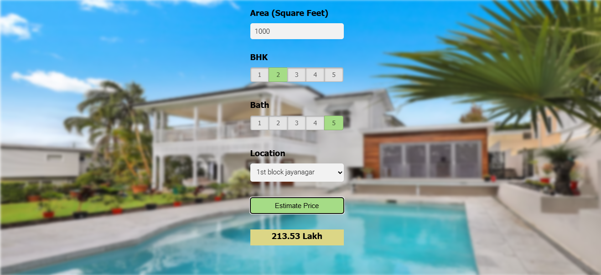

# Bengaluru House Price Prediction
A full-stack machine learning project to predict real estate prices in Bengaluru, India. This project demonstrates the end-to-end process of building, deploying, and serving a regression model using Python, scikit-learn, Flask, and a simple HTML/CSS/JavaScript frontend.

## Features
- **Data Science Pipeline:** Data cleaning, outlier detection, feature engineering, model training, and evaluation in Jupyter Notebook.
- **Model Serving:** Flask-based REST API for predictions.
- **Frontend:** Simple web UI for users to input property details and get price predictions.

## Output screenshot


## Technology
- Python
- Numpy and Pandas (data cleaning)
- Matplotlib (data visualization)
- Sklearn (model building)
- Jupyter notebook 
- Python flask (Http server)
- HTML/CSS/Javascript (UI)

## Project Structure
```
├── client/                # Frontend (HTML, CSS, JS)
├── model/                 # Data (.csv), model (.pickle), and notebook (.ipynb)
├── server/                # Backend (Flask API)
```

## Getting Started

### 1. Clone the Repository
```
git clone <repo-url>
```
```
cd <repo-folder>
```

### 2. Set Up Python Environment
```
py -m venv venv
```
```
venv/Scripts/activate
```
```
pip install -r requirements.txt
```

### 3. Prepare the Model
- Run the Jupyter notebook model/banglore_home_prices_final.ipynb
- The trained model will be stored in model/banglore_home_prices_model.pickle
- The columns info is stored in model/columns.json.
- Copy the model and json files to server/artifacts/ for the Flask server to access.

### 4. Run the Flask Server
```
cd server
```
```
python server.py
```
- The server will be available at http://localhost:5000.

### 5. Launch the Frontend
- Open client/app.html in your browser.
- Enter property details and get instant price predictions.

## API Endpoints
- GET /get_location_names  
Returns a list of available locations.

- POST /predict_home_price  
Predicts the price based on input features (location, sqft, BHK, bath).

## Acknowledgements
- Dataset: [Kaggle - Bengaluru House Price Data](https://www.kaggle.com/datasets/amitabhajoy/bengaluru-house-price-data)
- Inspired by real-world ML deployment scenarios